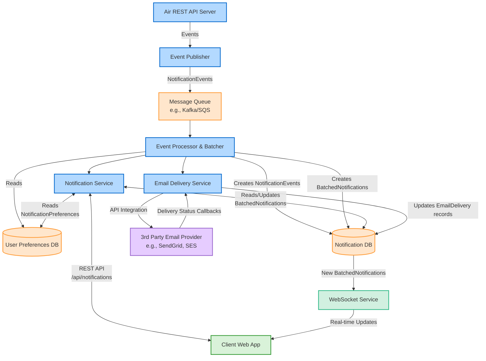

# High-Level Architecture Diagram

This diagram shows the overall architecture of the Air Unified Notification System, highlighting the key components and their interactions.

## Key Components

- **Air REST API Server**: The main application API that generates notification events based on user actions
- **Event Publisher**: Responsible for formatting and publishing notification events
- **Message Queue**: Provides asynchronous communication between components (e.g., Kafka, AWS SQS)
- **Event Processor & Batcher**: Processes events, applies batching rules, and determines recipients for notifications
- **Notification Service**: Manages notification delivery and REST API endpoints for client applications
- **WebSocket Service**: Handles real-time notification delivery to connected clients
- **Notification DB**: Stores notification data including NotificationEvents, BatchedNotifications, and EmailDelivery records
- **User Preferences DB**: Stores user NotificationPreferences including delivery channel settings (inAppEnabled, emailEnabled)
- **Email Delivery Service**: Handles email template rendering and communicates with third-party providers
- **3rd Party Email Provider**: External service for sending emails (e.g., Amazon SES, SendGrid)

## Communication Flows

1. **Event Generation**: User actions in the app generate NotificationEvents through the REST API, which are published to the message queue via the Event Publisher.

2. **Event Processing**: The Event Processor consumes NotificationEvents from the queue, checks user NotificationPreferences, applies batching logic, and creates or updates BatchedNotifications.

3. **Notification Delivery**:
   - **In-App**: New BatchedNotifications in the Notification DB trigger the WebSocket Service to push real-time updates to connected clients
   - **Email**: Processor requests Email Delivery Service to send emails via 3rd Party Provider, with EmailDelivery status tracked in the database

4. **API Access**: 
   - Clients interact with the Notification Service via REST API endpoints (e.g., `/api/notifications`, `/api/notifications/preferences`) to access historical notifications and manage preferences
   - Notification Service handles all database interactions, providing a clean API abstraction for the client

This architecture ensures separation of concerns, scalability, and reliability across the notification system. 