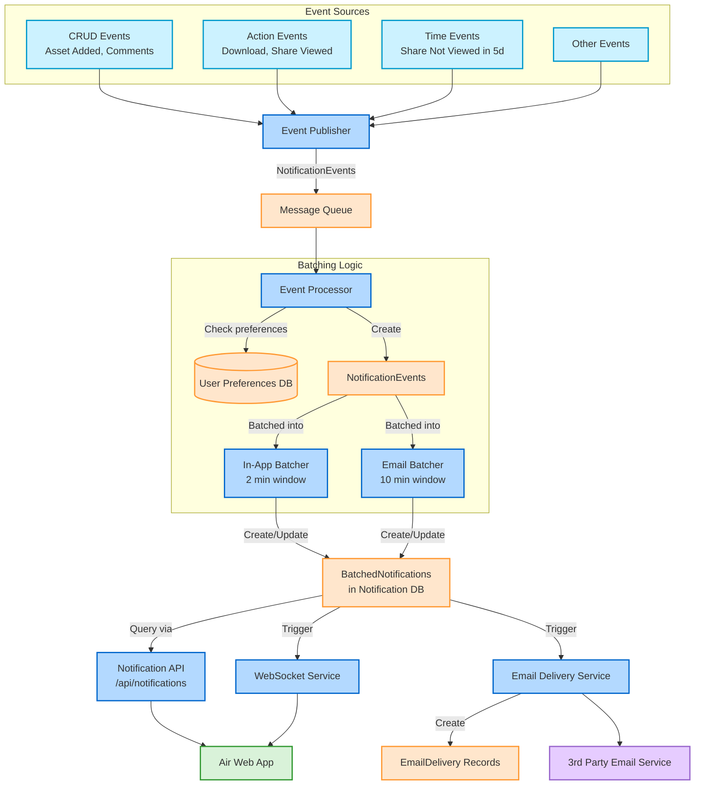

# Event Flow Diagram

This diagram illustrates how notification events flow through the system, from generation to delivery.

## Event Flow Process

1. **Event Sources**: Various system activities generate notification events:
   - CRUD events (asset added, comments created)
   - Action events (downloads, share link views)
   - Time-based events (notifications triggered after time passes)

2. **Event Publishing**: The Event Publisher formats events as NotificationEvents and sends them to the Message Queue

3. **Event Processing**: The Event Processor consumes NotificationEvents and processes them:
   - Checks user NotificationPreferences to determine delivery channels
   - Creates records in the NotificationEvents table
   - Routes events to appropriate batchers based on delivery channel

4. **Batching**: NotificationEvents are batched according to their type and delivery channel:
   - In-App notifications use a 2-minute debouncing window
   - Email notifications use a 10-minute debouncing window
   - Events are aggregated into BatchedNotifications with counts and summaries

5. **Storage**: BatchedNotifications are stored in the Notification DB

6. **Delivery**: Notifications are delivered through appropriate channels:
   - In-App notifications via Notification API and WebSocket Service to the Web App
   - Email notifications via Email Delivery Service to a 3rd Party Email Provider
   - Email delivery status tracked via EmailDelivery records 