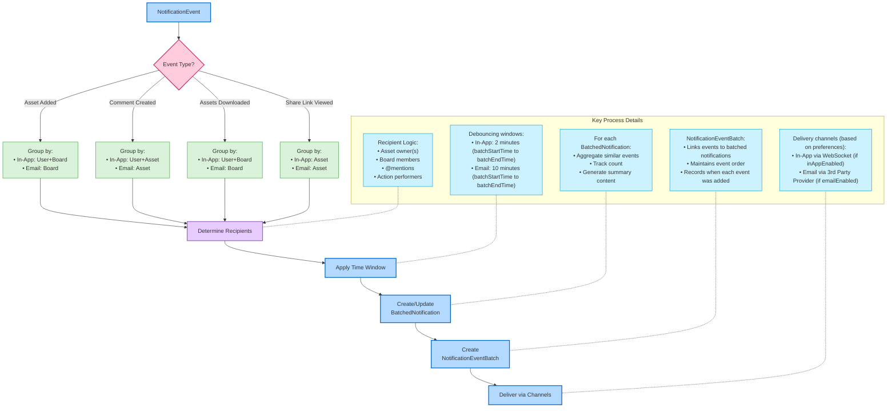

# Batching Logic Flow

This diagram shows how notification events are batched into consumable notifications, highlighting how event type determines grouping logic and recipient selection.

## Recipient Determination Rules

The system determines notification recipients based on the event type and context:

| **Notification Type** | **Recipients** | **Logic** |
| --------------------- | -------------- | --------- |
| Asset Added | Board members | All users with access to the board receive notifications when assets are added |
| Comment Created | Asset viewers + @mentions | Users who have viewed the asset + any users specifically @mentioned in the comment |
| Assets Downloaded | Asset owners | The users who own the assets that were downloaded |
| Share Link Viewed | Link creator | The user who created the share link |
| Share Link Not Viewed | Link creator | The user who created the share link |

After determining recipients, each recipient's NotificationPreferences are checked (inAppEnabled, emailEnabled) to filter delivery channels.

## Simple Batching Example

**Scenario**: UserA uploads 10 assets to "Marketing Board" and 3 assets to "Design Board" within 2 minutes. UserB uploads 5 assets to "Marketing Board" in the same timeframe.

**Processing Steps**:
1. Each upload creates a NotificationEvent
2. NotificationEvents are linked to BatchedNotifications via NotificationEventBatch records
3. The BatchedNotification stores count, content, and time window (batchStartTime, batchEndTime)

**Recipients**:
- All members of Marketing Board (UserC, UserD, UserE)
- All members of Design Board (UserC, UserF)

**Results**:
- **In-App BatchedNotifications** (if inAppEnabled):
  - For UserC, UserD, UserE: "UserA uploaded 10 assets to Marketing Board" and "UserB uploaded 5 assets to Marketing Board"
  - For UserC, UserF: "UserA uploaded 3 assets to Design Board"

- **Email BatchedNotifications** (if emailEnabled):
  - For UserC, UserD, UserE: "15 assets were uploaded to Marketing Board" (sent via 3rd party email provider)
  - For UserC, UserF: "3 assets were uploaded to Design Board" (sent via 3rd party email provider)

## Notification Type Grouping Logic

| **Notification Type** | **Group By for In-App** | **Group By for Email** | **Example BatchedNotification** |
| --------------------- | ----------------------- | ---------------------- | ----------- |
| Asset Added           | User + Board            | Board                  | "Mark uploaded 10 assets to Marketing Board" |
| Comment Created       | User + Asset            | Asset                  | "Sarah commented on file.jpg" |
| Assets Downloaded     | User + Board            | Board                  | "Alex downloaded 5 files from Product Launch" |
| Share Link Viewed     | Asset                   | Asset                  | "Share link for report.pdf was viewed 3 times" |
| Share Link Not Viewed | Asset                   | Asset                  | "Share link for logo.png hasn't been viewed in 5 days" | 