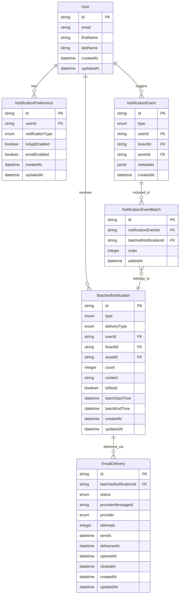

# Data Model Diagram

This diagram represents the database schema for the Air Notification System.

%%{init: {'theme': 'neutral', 'themeVariables': { 'primaryColor': '#b3d9ff', 'primaryBorderColor': '#0066cc', 'primaryTextColor': '#333', 'secondaryColor': '#ffe6cc', 'secondaryBorderColor': '#ff9933' }}}%%

## Key Entities

### User
Contains user information including email (for delivering email notifications) and name (for personalizing notification content).

### NotificationPreference
Stores user preferences for notifications, allowing users to opt in/out of specific notification types for each delivery method (in-app and email).

### NotificationEvent
Raw notification events generated by the system. These are individual events before batching, containing metadata about the event source (board, asset, user).

### NotificationEventBatch
Join table that explicitly tracks which NotificationEvents are included in which BatchedNotifications. This provides a clear record of which individual events were aggregated together, maintains order, and records when each event was added to the batch.

### BatchedNotification
Represents a notification that has been processed and batched according to the system's rules. This is what users will see in the app or receive via email. Includes the time window during which events were batched (batchStartTime and batchEndTime).

### EmailDelivery
Tracks the delivery status of email notifications sent through 3rd party email providers (e.g., SendGrid, Amazon SES), including provider tracking IDs, delivery attempts and event timestamps (sent, delivered, opened, clicked).

## Key Relationships

- A User has many NotificationPreferences (one per notification type)
- A User triggers many NotificationEvents
- A User receives many BatchedNotifications
- NotificationEvents are included in batches via the NotificationEventBatch join table
- BatchedNotifications may be delivered via Email (EmailDelivery)

## Batching Process

The NotificationEventBatch join table makes the batching relationship explicit:
1. As new NotificationEvents occur, they are evaluated for batching
2. If they match criteria for an existing batch within the time window, they are linked to that BatchedNotification
3. If no matching batch exists, a new BatchedNotification is created
4. The join table maintains the order of events and when they were added to each batch
5. The BatchedNotification's count field is updated to reflect the total number of events

## Indexes and Query Patterns

For optimal performance, indexes should be created on:
- BatchedNotification: (userId, isRead, createdAt) - For retrieving unread notifications
- NotificationEvent: (type, createdAt) - For efficient batching
- NotificationEventBatch: (batchedNotificationId, notificationEventId) - For retrieving all events in a batch
- NotificationEventBatch: (notificationEventId) - For finding which batches an event belongs to
- NotificationPreference: (userId, notificationType) - For checking delivery preferences
- EmailDelivery: (batchedNotificationId, status) - For tracking delivery status 