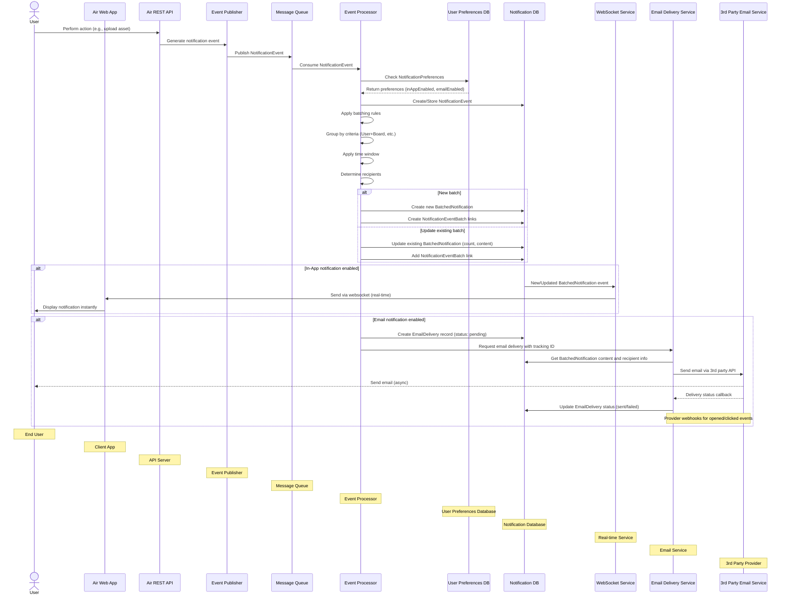

# Notification Creation Sequence Diagram

This diagram illustrates the sequence of operations that occur during notification creation and processing, including real-time delivery via websockets and email delivery tracking.

## Notification Creation and Delivery Process

1. **Triggering Event**: A user performs an action in the Air application (e.g., uploads assets, creates comments)

2. **Event Generation**: The Air REST API detects the action and generates a NotificationEvent

3. **Event Publishing**: The NotificationEvent is published to a message queue for asynchronous processing

4. **Event Processing**: The Event Processor:
   - Consumes the NotificationEvent from the queue
   - Checks user NotificationPreferences in the User Preferences DB
   - Stores the NotificationEvent in the Notification DB
   - Applies batching rules based on notification type
   - Groups events by appropriate criteria (User+Board, Asset, etc.)
   - Applies the debouncing time window
   - Determines who should receive the notification

5. **BatchedNotification Creation**:
   - If this is a new notification group, a new BatchedNotification is created
   - If a similar notification exists within the time window, it's updated (incrementing count, updating content)
   - NotificationEventBatch records are created to link NotificationEvents to their BatchedNotifications
   - The BatchedNotification stores attributes like count, content, and time window information

6. **Notification Delivery**:
   - **In-App Notifications** (if inAppEnabled is true):
     - New/Updated BatchedNotifications trigger the WebSocket Service
     - Notifications are delivered in real-time to connected clients
     - Displayed instantly in the web app UI
   - **Email Notifications** (if emailEnabled is true):
     - EmailDelivery record created in database (with pending status)
     - Email Service retrieves BatchedNotification content and recipient data
     - Email Service sends via 3rd Party Provider API
     - Provider sends email to recipients
     - Delivery status callbacks update the EmailDelivery record
     - Email provider webhooks update additional status events (opened, clicked, etc.)

This approach ensures comprehensive notification handling with:
- Clear relationship tracking between individual events and batched notifications
- Preference-based delivery to respect user notification settings
- Real-time delivery for active users via websockets
- Reliable email delivery with complete tracking through EmailDelivery records
- Proper separation of concerns between data storage and service communication 