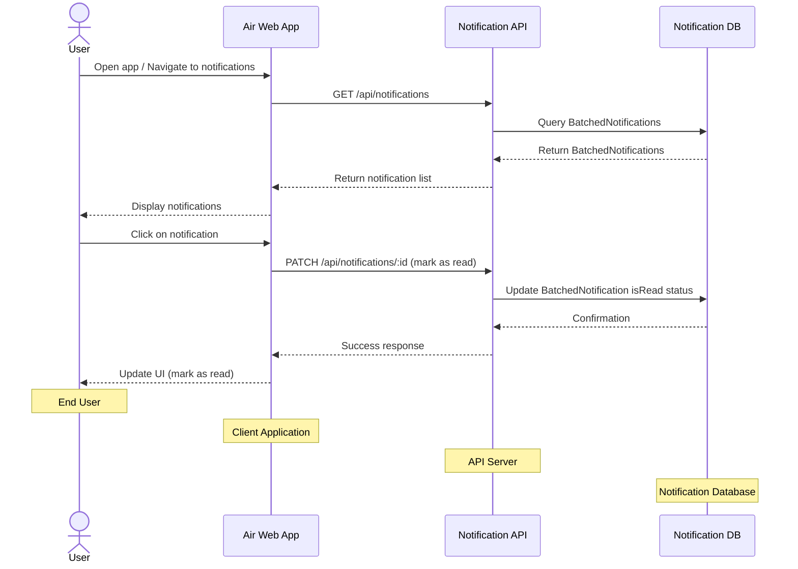

# Notification API and Fetch Flow

This diagram illustrates how notifications are fetched and managed by users through the application.



## Notification API Endpoints

### Fetch Notifications
```
GET /api/notifications
```

**Query Parameters:**
- `limit`: Maximum number of notifications to return (default: 20)
- `cursor`: Cursor for pagination (optional)
- `read`: Filter by read status (`true`, `false`, or `all`) (default: `all`)

**Response:**
```json
{
  "notifications": [
    {
      "id": "notification-123",
      "type": "ASSET_ADDED",
      "content": "Mark uploaded 10 assets to 10/2024 Photo Shoot",
      "count": 10,
      "boardId": "board-123",
      "assetId": null,
      "isRead": false,
      "batchStartTime": "2023-05-15T14:28:00Z",
      "batchEndTime": "2023-05-15T14:30:00Z",
      "createdAt": "2023-05-15T14:30:00Z",
      "updatedAt": "2023-05-15T14:30:00Z"
    },
    // More BatchedNotifications...
  ],
  "nextCursor": "notification-789"
}
```

### Mark Notification as Read
```
PATCH /api/notifications/:id
```

**Request Body:**
```json
{
  "isRead": true
}
```

**Response:**
```json
{
  "id": "notification-123",
  "isRead": true,
  "updatedAt": "2023-05-15T15:45:00Z"
}
```

### Mark All Notifications as Read
```
PATCH /api/notifications/mark-all-read
```

**Response:**
```json
{
  "count": 5,
  "success": true
}
```

### Get Notification Count
```
GET /api/notifications/count
```

**Response:**
```json
{
  "total": 10,
  "unread": 5
}
```

### Get Notification Preferences
```
GET /api/notifications/preferences
```

**Response:**
```json
{
  "preferences": [
    {
      "id": "pref-123",
      "notificationType": "ASSET_ADDED",
      "inAppEnabled": true,
      "emailEnabled": false
    },
    // More NotificationPreference records...
  ]
}
```

### Update Notification Preferences
```
PATCH /api/notifications/preferences/:id
```

**Request Body:**
```json
{
  "inAppEnabled": true,
  "emailEnabled": false
}
```

**Response:**
```json
{
  "id": "pref-123",
  "notificationType": "ASSET_ADDED",
  "inAppEnabled": true,
  "emailEnabled": false,
  "updatedAt": "2023-05-15T15:45:00Z"
}
``` 