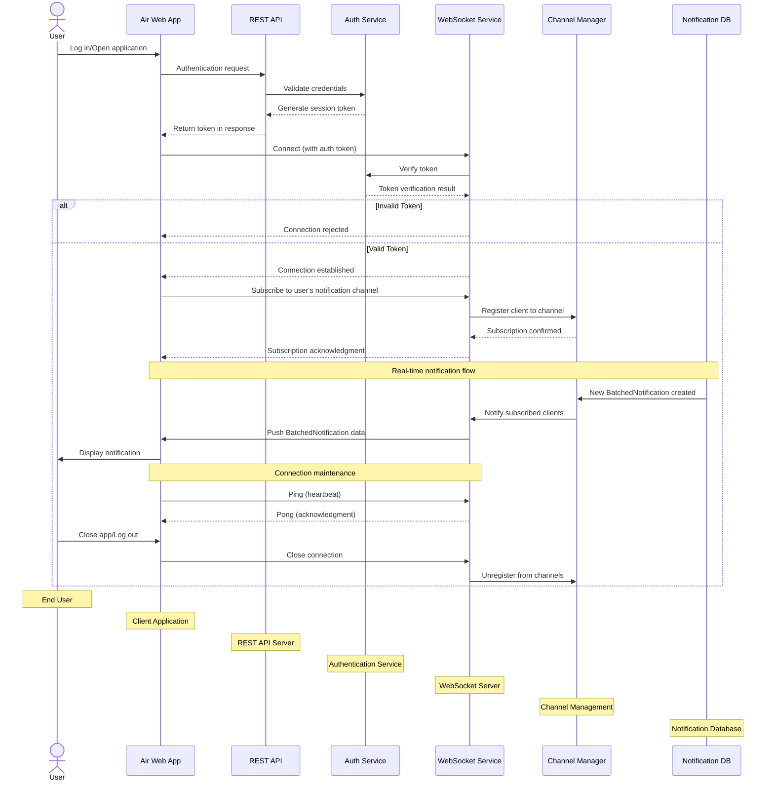

# WebSocket Connection and Subscription Flow

This diagram details the process of establishing a WebSocket connection and subscribing to notification channels for real-time updates.

## WebSocket Connection Lifecycle

### 1. Authentication and Token Acquisition
The client first obtains an authentication token through the standard REST API:
- User logs in or opens the application
- Client requests authentication from the API
- API validates credentials and returns a session token
- This token will be used to authenticate the WebSocket connection

### 2. WebSocket Connection Establishment
The client establishes a WebSocket connection:
- Client initiates WebSocket connection with the auth token
- WebSocket server verifies the token with Auth Service
- If valid, connection is established; if invalid, connection is rejected

### 3. Channel Subscription
After connection is established, the client subscribes to relevant notification channels:
- Client requests subscription to user's notification channel
- WebSocket server registers client with Channel Manager
- Subscription confirmation is sent back to client

### 4. Real-time Notification Delivery
Once subscribed, the client receives BatchedNotifications in real time:
- When a new BatchedNotification is created or updated in the Notification DB
- Channel Manager identifies subscribed clients
- WebSocket server pushes BatchedNotification data to relevant clients
- Client displays the notification without polling

### 5. Connection Maintenance
To keep the connection alive:
- Client sends periodic ping messages (heartbeats)
- WebSocket server responds with pong acknowledgments
- This prevents connection timeouts and confirms both sides are active

### 6. Disconnection
When the user closes the app or logs out:
- Client initiates connection close
- WebSocket server unregisters client from notification channels
- Resources are released on both ends

## Implementation Considerations

- **Scalability**: Consider using Redis Pub/Sub or similar technology for channel management in distributed environments
- **Reconnection Strategy**: Implement exponential backoff for reconnection attempts when connection is lost
- **Message Delivery Guarantees**: Consider using acknowledgments for critical notifications
- **Security**: Implement token expiration, rotation, and validation to prevent unauthorized access
- **Fallback**: Provide REST API polling as a fallback for environments where WebSockets are blocked 